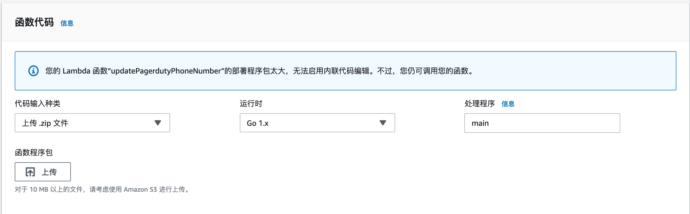
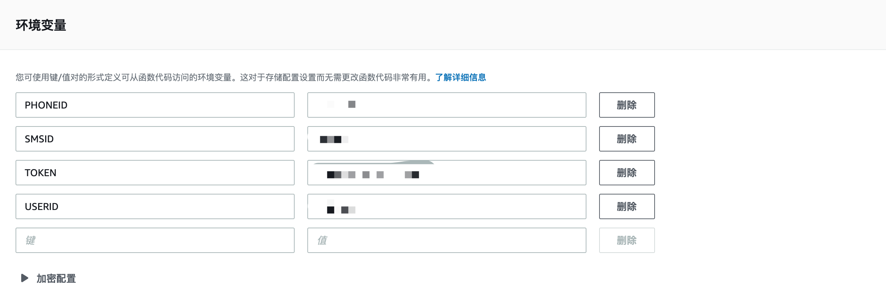
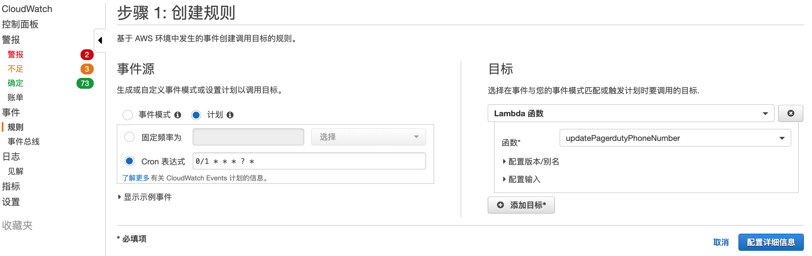
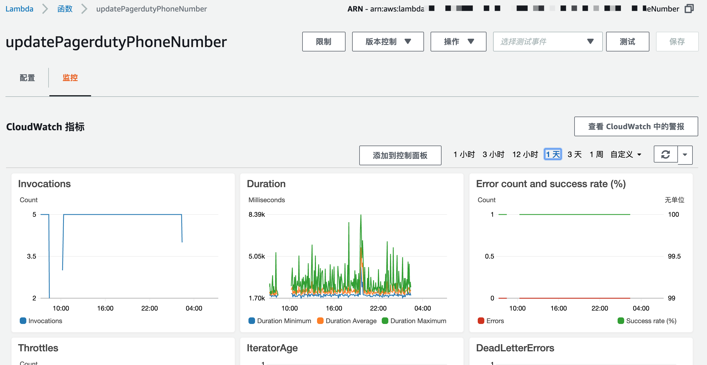
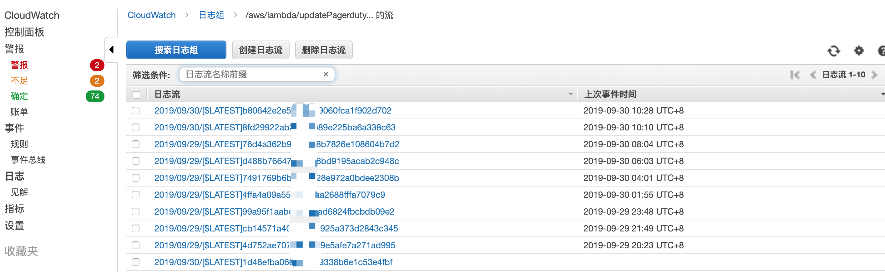
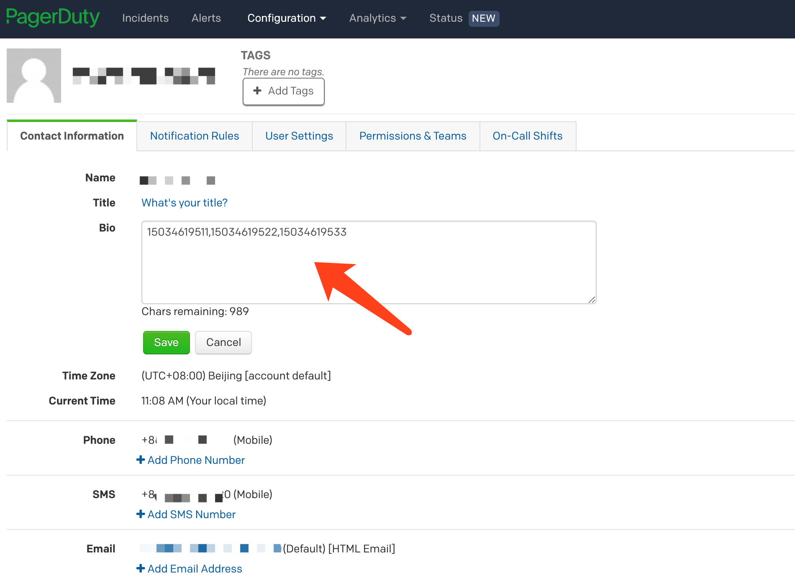

# PagerdutyCostContro

## 一、需求概述
pagerduty每个账户每个月70美元，为了节省用户成本，只需要使用一个用户，定时去改这个用户的手机号为值班人员。


## 二、功能

- 单个用户最大可支持85人循环值班
- 可灵活配置换班时间点
- 节省Pagerduty用户成本
- 配置简单，灵活
- 支持部署在Aws Lambda服务，无需服务器支持

## 三、部署方式

### 1、host：部署到主机

#### dowload
```
git clone https://github.com/BigbigY/PagerdutyCostContro.git

```

#### Build
```
➜ cd host
➜ GOOS=linux GOARCH=amd64 go build main.go
```

#### help
```
./PagerdutyCostContro -h
  -authtoken string
        Pagerduty token (default "B3T9zaAaaAAE_bDn7u3")
  -phoneid string
        Pagerduty contact Phone ID (default "P2CHQID")
  -smsid string
        Pagerduty contact Sms ID (default "P925PL3")
  -userid string
        Pagerduty user ID (default "PY1KOA3")
```

#### start
```
./PagerdutyCostContro -authtoken="AUTHTOKEN" -userid="USERID" -phoneid="PHONEID" -smsid="SMSID"
```

### 2、Lambda：部署到AWS Lambda

#### 创建部署程序包

使用 go get 下载适用于 Go 的 Lambda 库，并编译您的可执行文件,压缩zip包
```
➜ go get github.com/aws/aws-lambda-go/lambda
➜ GOOS=linux go build main.go
➜ zip function.zip main
```

#### 创建Aws Lambda

- 运行时Go1.x
- 处理程序main(编译时二进制名称)
- 上传程序包

#### 配置环境变量
获取ID接口：https://api-reference.pagerduty.com/#!/Users/get_users_id_contact_methods


#### 创建cloudwatch触发器

| 频率                  | 表达式   |
|------------------------------- | ------------ |
| 每天上午 10:15 (UTC)                | 	cron(15 10 * * ? *)    |
|星期一到星期五的下午 6:00                 | cron(0 18 ? * MON-FRI *) |
|每月第一天早上 8:00 | cron(0 8 1 * ? *)       |
| 工作日每隔 10 分钟          | cron(0/10 * ? * MON-FRI *)     |
| 工作日早上 8:00 到下午 5:55 期间每隔 5 分钟              | cron(0/5 8-17 ? * MON-FRI *)    |
|  每月第一个星期一早上 9:00    | cron(0 9 ? * 2#1 *)         |


CloudWatch创建定时任务及绑定到要应用的Lambda

#### 查看执行监控指标

error指标红线大于0,需要去看下日志

#### 排错日志

日志文件列表，查看对应日志文件内容

## 四、Pagerduty配置说明

在Bio中配置要轮值的联系人手机号，使用`,`分割


